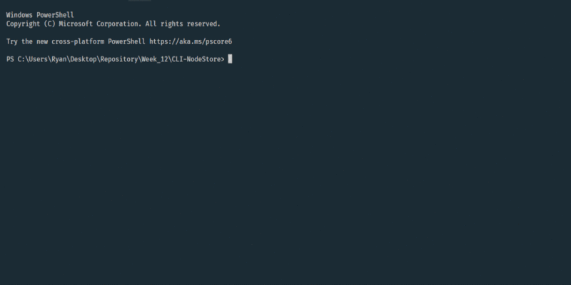

# CLI-NodeStore
A practice exercise connecting SQL database to a CLI interface

Instructions:

1. Run "npm install" in project directory to download dependencies.
2. Create a local database by running schema.sql in your favorite SQL workspace (I used MySQL Workbench).
2. Navigate to the project directory and enternpm run start.
3. Follow the prompts in the terminal.

=============================================================

</img>